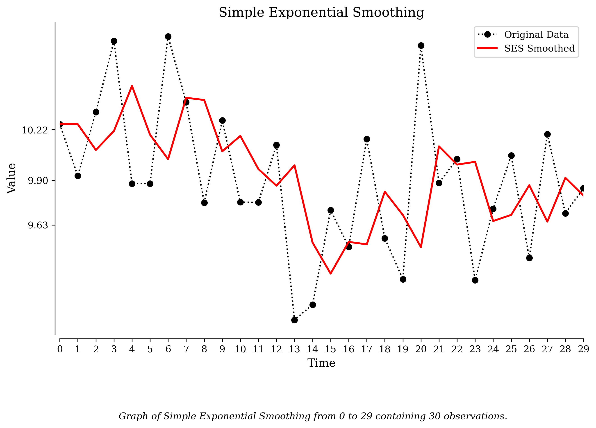
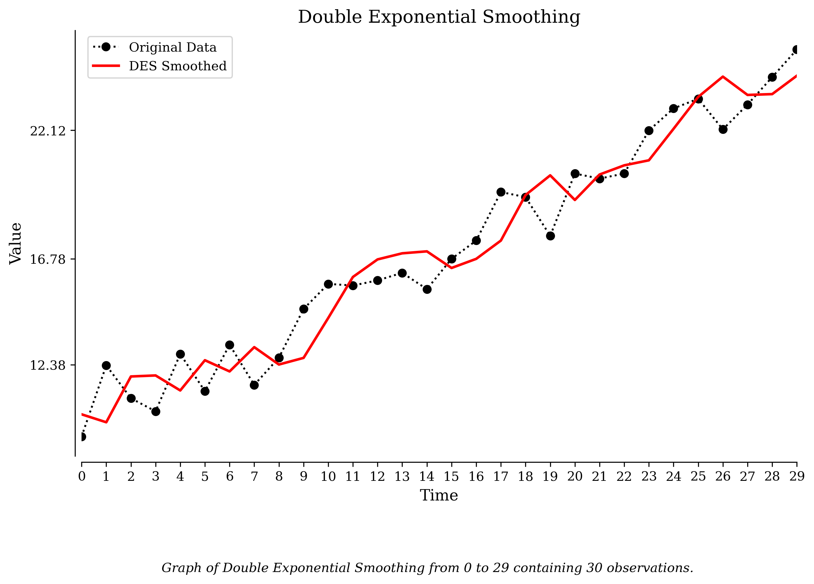
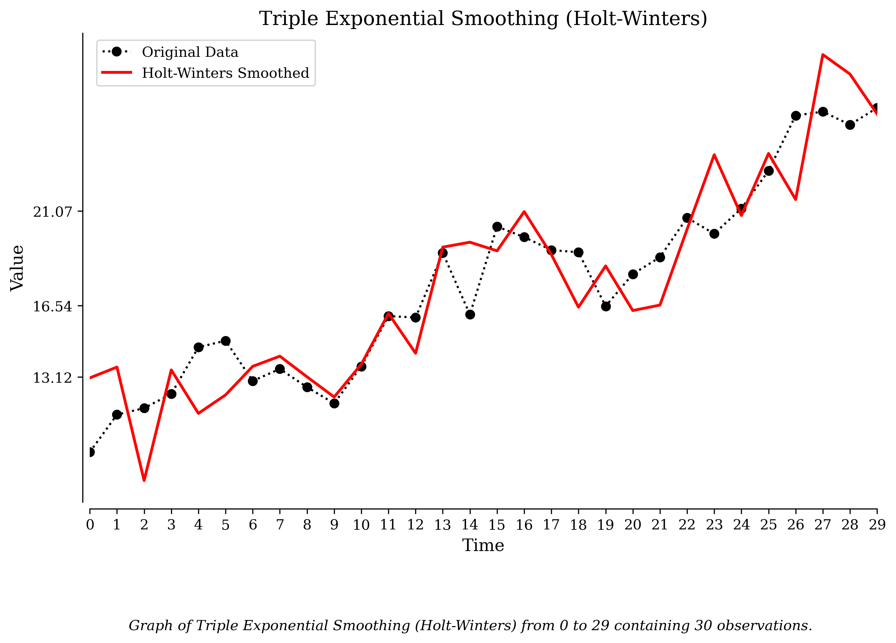

# Exponential Smoothing for Time Series Forecasting with Python

Exponential smoothing is a simple forecasting technique that gives more weight to recent observations while gradually reducing the influence of older data. This approach makes it particularly effective for capturing trends and patterns in time series data, especially when compared to methods like moving averages.

## What is Exponential Smoothing?

Exponential smoothing is about using past observations to make predictions, but with a twist. Recent data points are weighted more heavily than older ones, which makes the method responsive to changes in the data while still smoothing out noise.

Think of it like giving more attention to what just happened while not completely forgetting the past. For example, if predicting the weather, we would give extra weight to the temperature from yesterday and the day before, but we would still use the temperature from two weeks ago.

## Types of Exponential Smoothing

There are three main types of exponential smoothing methods:

- **Simple Exponential Smoothing (SES):** Best for data without trends or seasonality.

- **Double Exponential Smoothing (DES):** Captures linear trends but no seasonality.

- **Triple Exponential Smoothing (Holt-Winters):** Captures both trends and seasonality.

## Simple Exponential Smoothing (SES)

Simple Exponential Smoothing is used when the data has no trend or seasonality. It works by averaging past values but gives more weight to recent observations.

**Example: Beehive Weight Without Trend or Seasonality** Imagine you're monitoring the daily weight of a beehive. The weight changes slightly every day, but there's no clear trend or seasonal pattern.

    from statsmodels.tsa.holtwinters import SimpleExpSmoothing

    # Generate synthetic data (constant with slight noise)
    np.random.seed(42)
    time = np.arange(30)
    data = 10 + np.random.normal(scale=0.5, size=len(time))

    # Apply Simple Exponential Smoothing
    model = SimpleExpSmoothing(data)
    fit = model.fit(smoothing_level=0.5, optimized=False)
    smoothed = fit.fittedvalues

    # Plot the data and smoothed values
    plt.figure(figsize=(10, 6))
    plt.plot(time, data, label="Original Data", marker="o")
    plt.plot(time, smoothed, label="SES Smoothed", color="red")
    plt.title("Simple Exponential Smoothing")
    plt.xlabel("Time")
    plt.ylabel("Value")
    plt.legend()
    plt.savefig("SES_example.png")
    plt.show()

SES smooths out the noise, making it easier to see the general pattern.

## Double Exponential Smoothing (DES)

Double Exponential Smoothing is suitable for data with a trend but no seasonality. It accounts for trends by combining:

- A smoothed version of the current value.

- A trend estimate that adjusts the forecast as the data grows or declines.

**Example: Beehive Weight with a Growing Trend** Imagine your beehive is steadily gaining weight as the bees produce more honey.

    from statsmodels.tsa.holtwinters import ExponentialSmoothing

    # Generate synthetic data (linear trend with noise)
    data = 10 + 0.5 * time + np.random.normal(scale=1.0, size=len(time))

    # Apply Double Exponential Smoothing
    model = ExponentialSmoothing(data, trend="add", seasonal=None)
    fit = model.fit(smoothing_level=0.5, smoothing_trend=0.5, optimized=False)
    smoothed = fit.fittedvalues

    # Plot the data and smoothed values
    plt.figure(figsize=(10, 6))
    plt.plot(time, data, label="Original Data", marker="o")
    plt.plot(time, smoothed, label="DES Smoothed", color="red")
    plt.title("Double Exponential Smoothing")
    plt.xlabel("Time")
    plt.ylabel("Value")
    plt.legend()
    plt.savefig("DES_example.png")
    plt.show()

 DES captures the upward trend, making it more accurate for forecasting growing or declining data.

## Triple Exponential Smoothing (Holt-Winters)

Triple Exponential Smoothing, also known as Holt-Winters, is used when the data has both a trend and a seasonal pattern. It adds a seasonal component to handle repeating patterns.

**Example: Beehive Weight with Trend and Seasonality** Imagine bee activity follows a seasonal cycle, with predictable increases and decreases every month.

    # Generate synthetic seasonal data
    data = 10 + 0.5 * time + 2 * np.sin(2 * np.pi * time / 12) + np.random.normal(scale=1.0, size=len(time))

    # Apply Triple Exponential Smoothing (Holt-Winters)
    model = ExponentialSmoothing(data, trend="add", seasonal="add", seasonal_periods=12)
    fit = model.fit(smoothing_level=0.5, smoothing_slope=0.5, smoothing_seasonal=0.5, optimized=False)
    smoothed = fit.fittedvalues

    # Plot the data and smoothed values
    plt.figure(figsize=(10, 6))
    plt.plot(time, data, label="Original Data", marker="o")
    plt.plot(time, smoothed, label="Holt-Winters Smoothed", color="red")
    plt.title("Triple Exponential Smoothing (Holt-Winters)")
    plt.xlabel("Time")
    plt.ylabel("Value")
    plt.legend()
    plt.savefig("Holt_Winters_example.png")
    plt.show()

 Holt-Winters smoothing adjusts for both trends and seasonal cycles, fitting the data well and providing accurate forecasts for data with recurring patterns.

Exponential smoothing is simple but useful. It is easy to understand and can be applied in a wide range of time series situations. The choice between simple, double, and triple exponential smoothing depends on the presence of trends and seasonality in your data, but you can easily try all three.

Exponential Smoothing is simple to implement and interpret. It can be applied to different types of time series (stationary, trending, and seasonal). We can choose the amount of noise we want to smooth out while still maintaining the trend and seasonality.

## Drawbacks of Exponential Smoothing

- **Limited Complexity:** Cannot model complex patterns or multiple seasonality effectively.

- **Parameter Sensitivity:** Forecast accuracy is sensitive to the choice of smoothing parameters.

- **No Causality:** Does not model causal relationships, only time-based patterns.

Exponential smoothing is a useful tool for time series forecasting especially for short-term forecasts. It is commonly used in inventory management, financial analysis, and demand forecasting. Its simplicity and ease of implementation make it an excellent choice for beginners and practitioners looking for quick and reliable time series models. For more complex patterns, combining exponential smoothing with other advanced techniques, such as ARIMA or machine learning models, can provide even better forecasting performance.

## Key Takeaways

- **Simple Exponential Smoothing (SES):** Best for data without trends or seasonality.
- **Double Exponential Smoothing (DES):** Captures linear trends but no seasonality.
- **Triple Exponential Smoothing (Holt-Winters):** Captures both trends and seasonality.
- A smoothed version of the current value.
